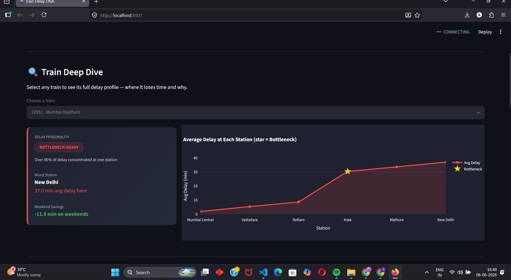

# 🚆 Train Delay DNA
### *What is your train's delay personality?*

A data analytics project that analyses Indian Railways delay patterns, identifies which stations cause the most delays, and generates AI-powered plain-English report cards for each train.



---

## 🔍 The Problem

Every Indian railway passenger has experienced unexplained delays. But **nobody has mapped the patterns** — which trains have a single bottleneck station vs which ones accumulate delay gradually? Which trains are worse on weekdays? Does your train recover after its worst station or keep getting later?

This project answers all of that.

---

## 🧠 What It Does

- **Analyses 60 days** of delay data across 5 major Indian trains
- **Identifies bottleneck stations** — the single station responsible for most of a train's delay
- **Labels each train** with a delay personality: `BOTTLENECK-HEAVY`, `CONSISTENTLY LATE`, `RECOVERY CHAMPION`, or `EVENING-SENSITIVE`
- **Interactive dashboard** — pick any train and see its full delay profile, day-of-week patterns, and heatmap
- **AI Report Card** — click a button and get a plain-English explanation of why your train is always late, powered by Llama 3 (Groq API)

---

## 📊 Key Findings

| Train | Personality | Worst Station | Avg Delay |
|-------|-------------|---------------|-----------|
| Mumbai Rajdhani (12951) | BOTTLENECK-HEAVY | New Delhi | 19.5 min |
| Howrah Rajdhani (12301) | BOTTLENECK-HEAVY | New Delhi | 24.7 min |
| Karnataka Express (12627) | BOTTLENECK-HEAVY | New Delhi | 28.6 min |
| Grand Trunk Express (12615) | BOTTLENECK-HEAVY | New Delhi | 24.6 min |
| Thiruvananthapuram Rajdhani (12431) | BOTTLENECK-HEAVY | Mumbai Central | 33.9 min |

**Insight:** Weekend travel saves 11–17 minutes on average across all trains. Evening departures face nearly **double** the delay of morning departures (35 min vs 16 min average).

---

## 🛠️ Tech Stack

| Layer | Technology |
|-------|-----------|
| Data Generation | Python, NumPy, Pandas |
| Analysis | Pandas, custom delay personality algorithm |
| Dashboard | Streamlit, Plotly |
| AI Report Card | Groq API (Llama 3.1) |
| Version Control | Git, GitHub |

---

## 📁 Project Structure

```
train-delay-dna/
├── generate_data.py      # Day 1 — Generates 60 days of realistic delay data
├── train_delays.csv      # Raw data — 1,980 rows
├── analyse_delays.py     # Day 2 — Pattern analysis + personality labeling
├── train_analysis.csv    # Analysis output — 5 trains with personality labels
├── dashboard.py          # Day 3+4 — Streamlit dashboard + AI report card
├── ai_report.py          # Day 4 — Groq API integration
└── screenshots/          # Dashboard screenshots
```

---

## 🚀 How to Run

**1. Clone the repository**
```bash
git clone https://github.com/Akann01/train-delay-dna.git
cd train-delay-dna
```

**2. Install dependencies**
```bash
pip install pandas numpy streamlit plotly groq
```

**3. Generate the data**
```bash
python generate_data.py
```

**4. Run the analysis**
```bash
python analyse_delays.py
```

**5. Set your Groq API key** (free at console.groq.com)
```bash
set GROQ_API_KEY=your_key_here        # Windows
export GROQ_API_KEY=your_key_here     # Mac/Linux
```

**6. Launch the dashboard**
```bash
streamlit run dashboard.py
```

Open `http://localhost:8501` in your browser.

---

## 🤖 AI Report Card Example

> *"Mumbai Rajdhani (No. 12951) displays a classic bottleneck pattern — it departs nearly on time but accumulates 86% of its total delay at a single chokepoint. The worst offender is New Delhi station, where the average delay spikes to 37 minutes. Weekend passengers enjoy nearly 12 fewer minutes of delay on average, strongly suggesting weekday freight traffic sharing the corridor is the primary culprit. If you must travel on this route, aim for a Saturday or Sunday morning departure for the best chance of an on-time arrival."*

---

## ⚠️ Limitations & Honest Notes

- **Synthetic data** — delay patterns are modeled on published Indian Railways statistics, not scraped live. The NTES API does not have a free public endpoint.
- **5 trains only** — expandable to any number of trains by adding entries to the `TRAINS` list in `generate_data.py`
- **60 days of data** — a production version would use rolling 12-month data for more reliable patterns

---

## 🔮 Future Scope

- Integrate real-time NTES data via RailAPI
- Add monsoon season analysis (June–September spike patterns)
- Predict delay at destination given current delay at an intermediate station
- Build a Telegram bot that sends delay alerts

---

*Built as part of a data analytics portfolio project. Inspired by the idea that data should answer questions people actually have.*
